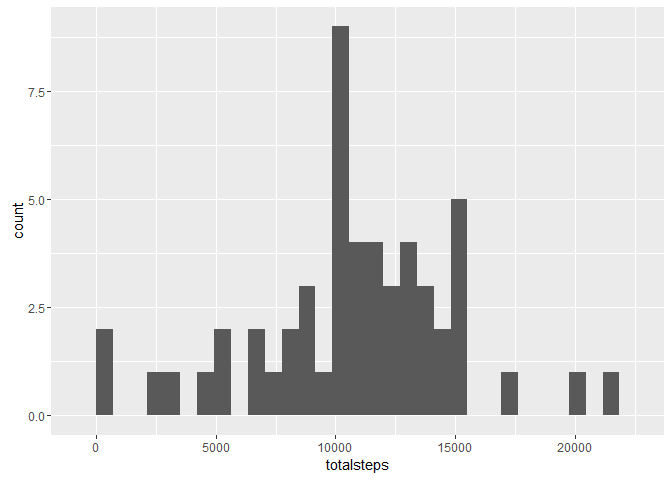
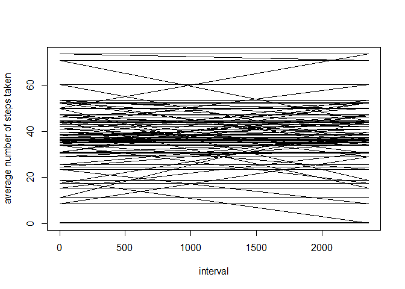

# Reproducible Research: Peer Assessment 1


## Loading and preprocessing the data
Read the csv file and then check the structure of the file.

```r
activity<-read.csv("./activity/activity.csv", header=TRUE)
str(activity)
```

```
## 'data.frame':	17568 obs. of  3 variables:
##  $ steps   : int  NA NA NA NA NA NA NA NA NA NA ...
##  $ date    : Factor w/ 61 levels "2012-10-01","2012-10-02",..: 1 1 1 1 1 1 1 1 1 1 ...
##  $ interval: int  0 5 10 15 20 25 30 35 40 45 ...
```
Reformat the date and check that it is a 'date' class. 

```r
library(lubridate)
activity$date<-ymd(activity$date)
str(activity)
```

```
## 'data.frame':	17568 obs. of  3 variables:
##  $ steps   : int  NA NA NA NA NA NA NA NA NA NA ...
##  $ date    : POSIXct, format: "2012-10-01" "2012-10-01" ...
##  $ interval: int  0 5 10 15 20 25 30 35 40 45 ...
```

Re-group the data into dates. 

```r
library(dplyr)
```

```
## 
## Attaching package: 'dplyr'
```

```
## The following objects are masked from 'package:lubridate':
## 
##     intersect, setdiff, union
```

```
## The following objects are masked from 'package:stats':
## 
##     filter, lag
```

```
## The following objects are masked from 'package:base':
## 
##     intersect, setdiff, setequal, union
```

```r
tbl_df(activity)
```

```
## Source: local data frame [17,568 x 3]
## 
##    steps       date interval
##    (int)     (time)    (int)
## 1     NA 2012-10-01        0
## 2     NA 2012-10-01        5
## 3     NA 2012-10-01       10
## 4     NA 2012-10-01       15
## 5     NA 2012-10-01       20
## 6     NA 2012-10-01       25
## 7     NA 2012-10-01       30
## 8     NA 2012-10-01       35
## 9     NA 2012-10-01       40
## 10    NA 2012-10-01       45
## ..   ...        ...      ...
```

```r
perday<-group_by(activity, date)
```
## What is mean total number of steps taken per day?

Calculate the total number of steps taken per day. 

```r
totalperday<-summarise(perday, totalsteps = sum(steps))
library(ggplot2)
qplot(totalsteps, data=totalperday, geom="histogram")
```

```
## `stat_bin()` using `bins = 30`. Pick better value with `binwidth`.
```

```
## Warning: Removed 8 rows containing non-finite values (stat_bin).
```

\

```r
mean(totalperday$totalsteps, na.rm=TRUE)
```

```
## [1] 10766.19
```

```r
median(totalperday$totalsteps, na.rm=TRUE)
```

```
## [1] 10765
```

## What is the average daily activity pattern?
Calculate the average number of steps taken

```r
average<-mutate(perday,averagedsteps=mean(steps, na.rm=TRUE))
```

Calculate the average number of steps taken per day

```r
average2<-mutate(average, aveday = mean(averagedsteps, na.rm=TRUE))
```
Make a time series plot (i.e. `type = "l"`) of the 5-minute interval (x-axis) and the average number of steps taken, averaged across all days (y-axis)

```r
plot(average$interval, average$averagedsteps, type="l", xlab="interval", ylab="average number of steps taken" )
```

\
## Imputing missing values

1. Calculate and report the total number of missing values in the dataset (i.e. the total number of rows with `NA`s)

```r
sum(is.na(activity))
```

```
## [1] 2304
```
2. Devise a strategy for filling in all of the missing values in the dataset. The strategy does not need to be sophisticated. For example, you could use the mean/median for that day, or the mean for that 5-minute interval, etc.

- replace na by the mean number of steps  

3. Create a new dataset that is equal to the original dataset but with the missing data filled in.

```r
impute.mean<-replace(activity, is.na(activity), mean(activity$steps, na.rm = TRUE))
```

## Are there differences in activity patterns between weekdays and weekends?
